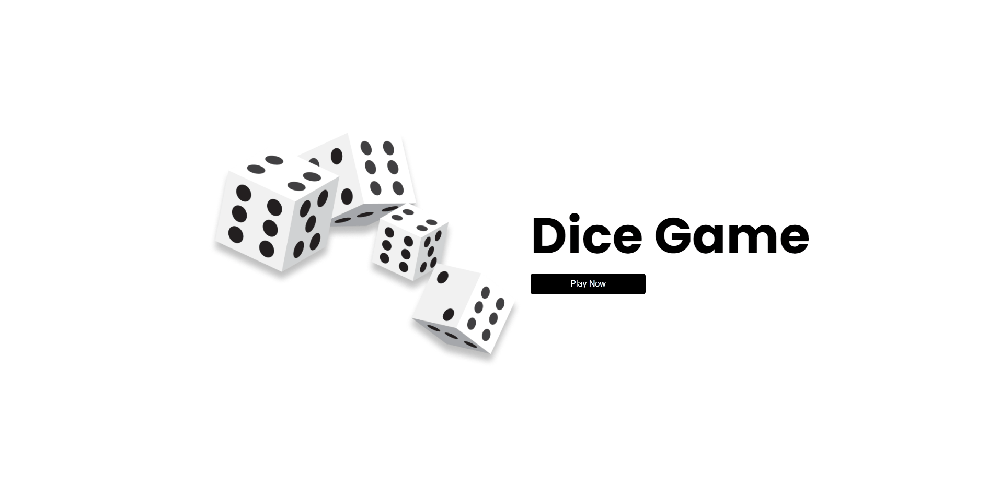

# Dice Game
Esse website foi feito utilizando, React.js.

Utilizei esse projeto de Dice Game para aplicar alguns conceitos práticos para aperfeiçoar meu React.js.

Para clonar o repositório:
- Tenha baixado o Node em seu computador.
- Abra o terminal da sua IDE, e digite `npm install`.
- Logo após a instalação, digite `npm run dev` para rodar o programa com o BrowserSync.

#
This minigame was made using React.js.

I used this Dice Game project to apply some practical concepts to improve my React.js.

To clone the repository:
- Have Node downloaded on your computer.
- Open your IDE's terminal, and type `npm install`.
- Right after installation, type `npm run dev` to run the program with BrowserSync.

## :camera_flash: Dice Game GIF

